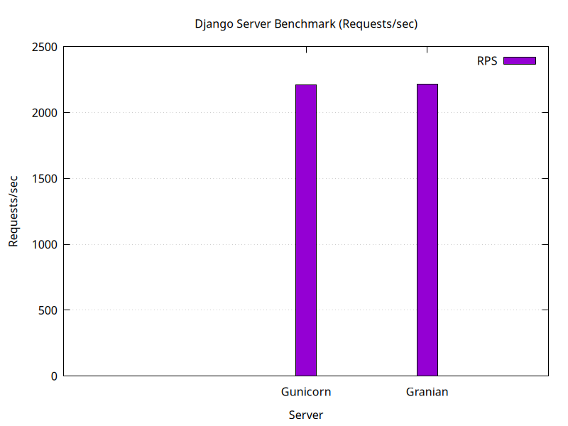

# granina-benchmark

 

# Django Server Benchmark Playground 🎉🚀

Welcome to the **Django Server Benchmark Playground** — a simple setup and benchmarking project where I put Django’s default development server, Gunicorn, and Granian through their paces.  
Tested on my own curiosity and just for fun!

---

## What’s inside? 🧐

- A bash script that **creates a minimal Django project** with a tiny app and a test view returning "OK".  
- A benchmarking script that runs load tests with [`wrk`](https://github.com/wg/wrk) on the three servers:
  - Django’s default runserver  
  - Gunicorn (the popular WSGI server)  
  - Granian (a fast Rust HTTP server for Python apps)  
- Nice charts generated using `gnuplot` to compare requests per second (RPS).

---

## Why?

Because I was curious how these servers stack up in speed and performance for a simple Django app.  
Also, it’s a fun way to practice some bash scripting, benchmarking, and data visualization.

---

## How to use

